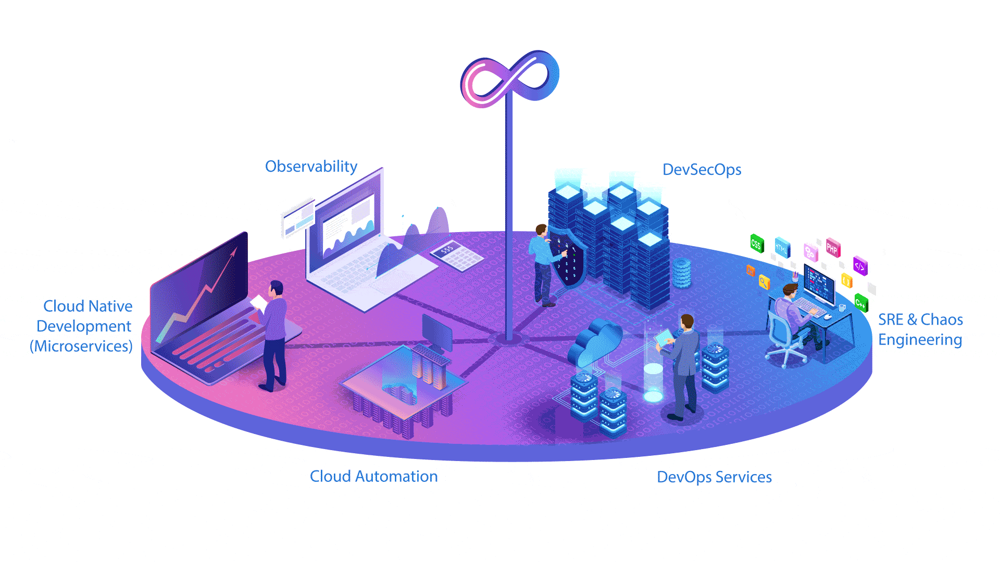

<h3 align="center"># The-future-of-DevOps
Are you here to know the future of DevOps Technologies – Latest Trends &amp; Scopes</h3>
<h1 align="center">Hi 👋, I'm Tulasi Kumar Sahu</h1>

  

<h3 align="center">A passionate DevOps Engineer from India, I work in the corporate IT sector. In my free time, I share knowledge through technical blogs on Hashnode and create educational YouTube videos on DevOps Alchemy.</h3>

  

"The RnD Lab of DevOps Alchemy" represents a forward-thinking and experimental approach to DevOps. Just as alchemists once sought to transform base metals into gold, the DevOps R&D Lab focuses on transforming traditional development and operations practices into highly efficient, automated, and innovative workflows.
What is the DevOps RnD Lab?

The "RnD Lab" symbolizes a dedicated space for research, experimentation, and innovation in DevOps. Here, teams explore emerging tools, frameworks, and methodologies to push the boundaries of modern software delivery and infrastructure management.
Alchemy in DevOps

The term alchemy suggests a transformation — turning challenges into opportunities by blending:

    Automation
    Cloud-native solutions
    Security (DevSecOps)
    Observability and Monitoring
    Site Reliability Engineering (SRE)
1. Cloud Native Development (Microservices)

    What it means: DevOps is increasingly embracing cloud-native technologies, where microservices architectures are central. Applications are broken into smaller, independent services that are easier to develop, test, and scale.
    Future Trend: Cloud-native development will dominate, with tools like Kubernetes and Docker playing key roles in container orchestration and deployment.

2. Cloud Automation

    What it means: Automation in cloud infrastructure is critical for scaling operations and managing resources efficiently. Tools like Terraform, Ansible, and AWS CloudFormation help automate provisioning and configuration.
    Future Trend: Cloud automation will continue to grow, enabling faster deployments, reduced manual intervention, and optimized resource utilization across multi-cloud environments.

3. Observability

    What it means: Observability ensures that systems can be monitored, debugged, and optimized effectively. This involves metrics, logs, and tracing to provide insights into system performance and health.
    Future Trend: Advanced observability tools like Prometheus, Grafana, and Datadog will be critical for real-time monitoring and improving system reliability in complex, distributed environments.

4. DevSecOps

    What it means: Integrating security into the DevOps pipeline (DevSecOps) ensures that security practices are automated and embedded throughout the software development lifecycle.
    Future Trend: With rising cybersecurity threats, DevSecOps will become a standard, incorporating automated security scanning, compliance checks, and vulnerability management into CI/CD pipelines.

5. DevOps Services

    What it means: DevOps as a service is growing, where companies rely on managed DevOps tools and platforms to handle infrastructure, CI/CD pipelines, and deployments.
    Future Trend: Serverless computing and managed DevOps services (like AWS DevOps, Azure DevOps) will simplify operations, allowing teams to focus more on innovation than infrastructure management.

6. SRE & Chaos Engineering

    What it means: Site Reliability Engineering (SRE) focuses on reliability and uptime, while Chaos Engineering tests system resilience by intentionally introducing failures.
    Future Trend: SRE practices and chaos engineering will play a vital role in ensuring high availability and resilience in modern systems, especially in cloud-native and microservices architectures.
   As DevOps evolves, it will continue to be the backbone of delivering faster, secure, and reliable software in a cloud-driven world.

<h3 align="center">Thank you for visiting my profile! 😊</h3>
<h3 align="center">Feel free to reach out for any DevOps-related queries or collaboration opportunities. Let's build amazing things together! 🚀</h3>
